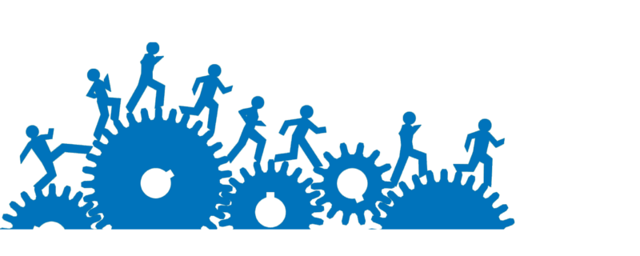

With just a laptop and a dream to be a World Class Entrepreneur and Software Engineer, i am writing this article to motivate people out there like me with big dreams but less hope, especially students.

As a student with such a big dream, i had to start work on my dreams as soon as possible. With my laptop and self taught coding skills, my first goal this year was to practice my coding skills in a production environment. In the previous year i had the opportunity to intern with a startup which boosted my confidence to make me work on a minor projects to enhance my skills. 

### I Joined AgroCenta

Earlier this year, with the aim of becoming a World Class Developer i joined AgroCenta. I am more than grateful to Edem Kumodzie for showing me this path. I can’t emphasis how much me joining AgroCenta has helped me grow. I have grown 10x working alongside amazing people like Michael Ockansey, Francis Obirikorang, Peter Perez, Micheal Sarpong plus the amazing support. I wouldn’t have gotten this far without them.At AgroCenta we are , more than just workers and teams and that is what makes me want to work everyday because it never feels like work.

### Won my first Hackathon 

Leading a group of Students from Spacelab we won a hackathon.

### Became ForLoop Ghana Organizer

I had the opportunity to be a community Organizer for ForLoopGhana.

### Mobile Web Specialist through ALC 3.0

I took part in Andela’s Learning Community Course 3.0

### Started my Entrepreneurship Journey

Started AppGharage with my firends.

### Birthed Epay

Epay is a payment service.

### On the Journey to be World Class

Conclusion
