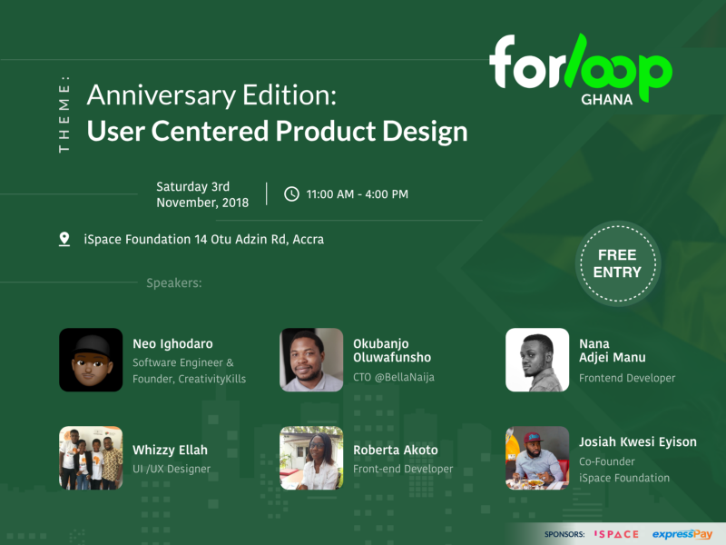

---

> forLoopGhana turns 1 in November! Unbelievable right? November is going to mark one year since [forloopGhana](https://twitter.com/forLoopGhana) started 🔥, since then there has been 3 developer meetups and a #forloopUniOfGhana [hackathon](https://twitter.com/forLoopGhana/status/973841500458115076)!

3rd November, 2018 will be a very special day at [ISpace Foundation](https://goo.gl/maps/kFchoDpAFq42), and from the plans, it promises to be a day to remember! Why? Because we will have our Anniversary meetup!

[forLoopGhana](https://twitter.com/forLoopGhana), which is a part of [forLoopAfrica](http://forloop.africa/) , is an independent community of software developers and enthusiasts across Africa. We currently have active forLoop communities in Nigeria, Ghana, Uganda, Kenya, Rwanda, Tanzania, Zambia, Sierra Leone, and the Gambia.

The Anniversary Edition themed _“User Centered Product Design”_ will see talks with topics ranging from _“Bread, Butter, and JAMStack”_ to _“Building world-class websites with CSS Grids”_. There is a talk for everyone, irrespective of your level. And did i also mention the event is free? Yes, It’s FREE and open to but not limited to software developers. All Tech enthusiasts are highly welcome! We will also showcase awesome applications built by Ghanaian developers.

To register for the event, head over [here](http://forloop.africa/events/forloopghana-anniversary-edition10yepzvjndop8d5).

A special thanks to our sponsors [iSpace Foundation](https://www.ispacegh.com/) and [ExpressPay](https://expresspaygh.com) for their commitment to building the developer network/ecosystem in Ghana and making this event possible.

If you are interested in organizing a #forLoop event in your university or city in Ghana, send an email to ore@forloop.africa. See you there !💥🇬🇭
