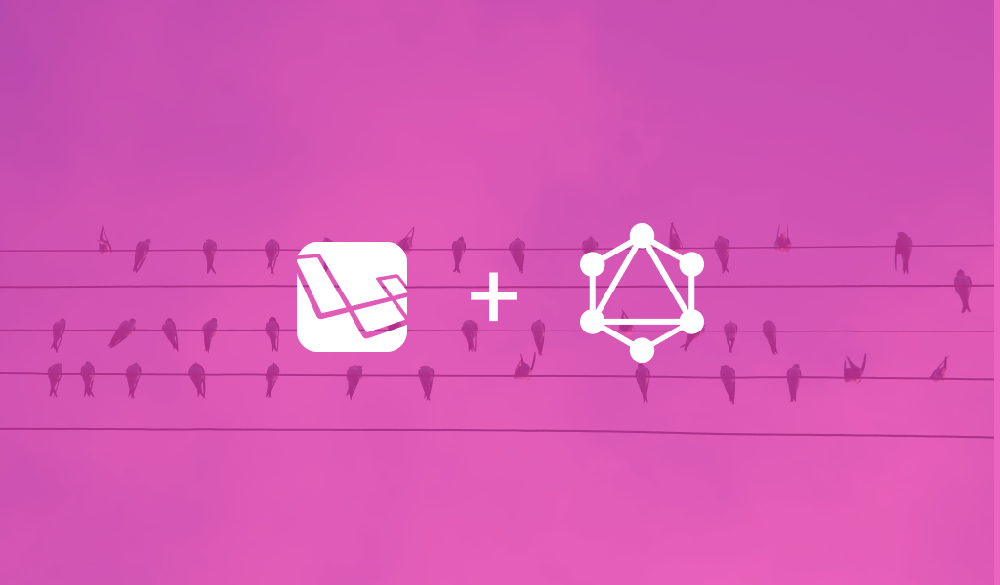

---

API's have evolved and continue to evolve, of course. Stepping into modern API development and infrastructure can be tough with so many acronyms such as `SOAP, REST & GraphQL` running around. In this series, we are going to look at how to build our own GraphQL server using Laravel. To make the series very easy to follow, i have divided it into 3 articles / parts.

* [Part 1: What is GraphQL and it's advantages? GraphQl vs REST](/how-to-build-a-graphql-server-using-laravel-part-1)
* [Part 2: Setup our laravel Project](/#)
* [Part 3: Setup our GraphQL Server & Playground in our project](/#)

## Why GraphQL?
 If you are afraid or think the word `GraphQL` sounds complicated and difficult, it isn't anymore. It isn't just the new kid on the block everyone is talking about, it's worth the hype. GraphQL is extremely handy when used to serve as an endpoint for different frontends such as mobile apps and single-page applications. You can create a GraphQL API in any programming language plus it's easy to setup in most major frameworks out there today.
  
Most of us have been creating and using REST APIs for a long time now so one may ask, what’s with all the excitement, how is GraphQL even different than REST? Though REST is an **Architecture** and GraphQL is a **Specification**, both tools are used to build and interact with APIs. 

> GraphQL is a data fetching specification that also functions as an API query language. It was created by Facebook back in 2012 to support their mobile application infrastructure and then open sourced in 2015.  — graphql.org


GraphQL clients control the data they get, not the server, making it easier for APIs to evolve over time. While typical REST APIs require loading from multiple URLs or endpoints, GraphQL APIs get all the data your app needs in a single request to a single endpoint. 

With GraphQL the goal is to create a `/graphql` endpoint without removing the REST endpoints. The GraphQL endpoint will hit the database directly to fetch data, so that it is totally independant from the REST logic.

## Graphql vs. REST: Why is GraphQL better?
1. REST requests often leads to over or under retrieval of information because endpoints return fixed data structures. Say you have a user resource on the back-end with first name, last name, email, and 10 other fields. On the client, you only need `first name, last name and email`. Making a REST call on the `/users` endpoint gives you back all the fields of the user, and the client only uses the ones it needs. There is clearly some data transfer waste, which might be too much load on mobile clients. 

    A similar query for GraphQL will be ;
    ```
    query {
      user {
        firstname
        lastname
        email
      }
    }
    ``` 

2. Let's also consider an application with these resources: `users, projects, and tasks` with their relationships. Things get trickier when we want to show only the projects’ titles on the home page, but all projects and their related tasks on the dashboard, without making multiple REST calls. One request is enough to get both our resource as well as related resources. It’s common practice to add query parameters such as `?include=tasks` on the projects endpoint to make this work, and is even recommended by the [JSON API specification](https://jsonapi.org/). Query parameters like `?include=tasks` are still readable, you will agree we will sooon end up with something like `?include=tasks, tasks.owner, tasks.comments, tasks.comments.author`. 
    
    Data fetching is often called out as the biggest improvement of GraphQL over REST. A similar query for GraphQL will be;
    ``` 
    query {
      user(id: 1) {
        projects {
          name
          tasks {
            description
          }
        }
      }
    }
    ``` 
3. When designing APIs we always start by trying to make the API as widely usable by all clients as possible, yet clients always want to make less API calls and get more data. With REST, there are a couple of solutions such as creating custom endpoints for a category of clients. 

    Since GraphQL gives more power to the client, a client that needs complex request will build the corresponding queries itself. Therefore, each client can consume the same API differently.

4. When working with REST APIs, we see frequent versioning — sometimes the field you are trying to fetch only exists in API v2, and was deprecated in v3. Versioning makes the code on both sides of an API less maintainable. 

    GraphQL APIs are able to be modified with new fields or types with no impact to existing queries. Fields can even be marked deprecated to exclude them from server responses.

5. After designing a REST API, you will need to document the endpoints with it's parameters and method of request. With GraphQL there's no need, as it's self documenting.

## Who’s uses GraphQL?
There are a number of companies that use GraphQL at scale. This includes;
- Facebook 
- GitHub
- Pinterest
- Intuit
- Shopify, etc.

## SOAP, REST, Graphql : Which one should I choose?
No API format is a silver bullet. They all have their strengths and weaknesses. Deciding on the one to use depends on the need. When considering which one is right for you, consider what clients you will be supporting and how flexible you need to be. I would advise you consider the following;
- For **SOAP**, it's use in certain situations, but is largely overshadowed as the veteran of the industry.
- **REST** remains the go-to technology for most public APIs becuase it's more popular and most developers are used to it
- **GraphQL** aside being the new kid on the block, it has solved a lot of REST’s problems, and boasts a ton of other interesting features.

**Note, it's possible to try GraphQL without throwing away your REST infrastructure.** 

I hope you enjoyed this article as in this part of the series, we got to know what GraphQL is, it's advantages and compared it to REST. Want to know more about GraphQL? Visit the [official documentation](https://graphql.org/) for more information. 

In the next part of this series, we will look at how to setup a mini Laravel blog after which we will develop GraphQL APIs for. Feel free to hit me up with your views, comments or questions.


