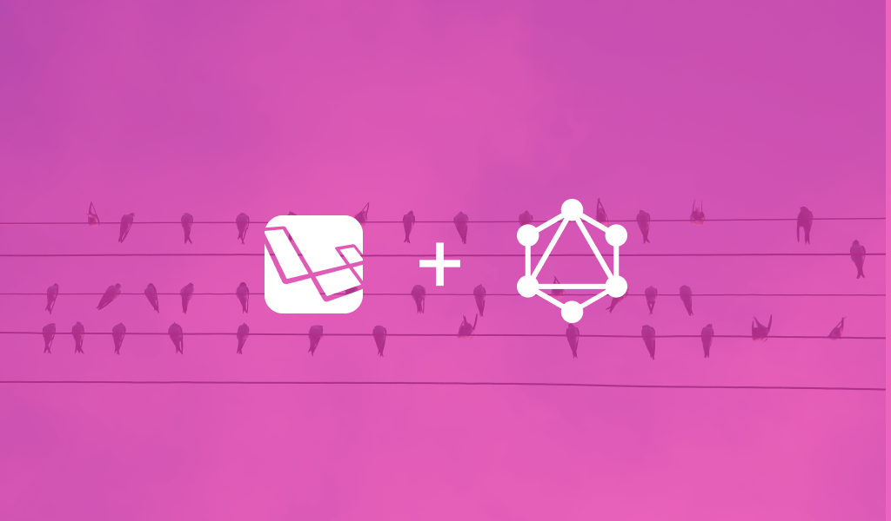

---

So far, we have understood what GraphQL is, it's advantages and compared it to REST. Furthermore, in the previous article, we setup our micro-blog's model and its database persistence. Now, it’s time to start building out our GraphQL server.

>If you haven't read any of the previous articles, use the links below to catch up:
> [Part 1: What is GraphQL and it's advantages? GraphQl vs REST](/how-to-build-a-graphql-server-using-laravel-part-1) ,
> [Part 2: Setup our Laravel Project](/how-to-build-a-graphql-server-using-laravel-part-2) , 
> [Part 3: Setup our GraphQL Server & Playground in our project](/how-to-build-a-graphql-server-using-laravel-part-3)

I hope you are as excited as I was writing this. Just to give you a heads up, currently, there are several packages / libraries that makes it easy to setup a GraphQL server using Laravel, but for this article, we’re going to use [Lighthouse](https://github.com/nuwave/lighthouse). To keep this tutorial simple, our GraphQL API will only allow us to retrieve the list of Users seeded and a specific user.
 

## Terminologies in GraphQL
Before we begin setting up our GraphQL server, let's first understand a few terminoligies you would come across alot in "GraphQL World": 

#### 1. Types
Data models in GraphQL are respresented as `Types`an they are strongly typed. Every GraphQL server defines a set of types which completely describe the set of possible data you can query on that service. Then, when queries come in, they are validated and executed against that schema. 

An example `Type` would be:
```javascript
type User {
    id: ID! # "!" means required or non-nullable
    name: String
    email: String
    articles: [Article!]! # "[Article]" is another GraphQL type which returns an array of `Article` objects.
}
```
> **Note**: There should always be a 1-to-1 mapping between your data models and GraphQL types.

#### 2. Field
A field is a unit of data you can retrieve from an object. According to the [official GraphQL docs](https://graphql.github.io/learn/queries/): "GraphQL is all about asking for specific fields on objects." 

An example `Query` would be:
```javascript
query {
  hero { # "hero" returns an Object 
    name # "name" is a field on the returned Object  
    appearsIn # "appearsIn" is a field on the returned Object  
  }
}
```

The results of the example `Query` above would be:
```json
{
  "data": {
    "hero": {
      "name": "R2-D2",
      "appearsIn": [
        "NEWHOPE",
        "EMPIRE",
        "JEDI"
      ]
    }
  }
}
```

#### 3. Scalar types
GraphQL comes with a set of default scalar types out of the box as listed below:
  * `Int`: A signed 32‐bit integer.
  * `Float`: A signed double-precision floating-point value.
  * `String`: A UTF‐8 character sequence.
  * `Boolean`: true or false.
  * `ID`: The `ID` scalar type represents a unique identifier, often used to refetch an object.

#### 4. Queries
Every GraphQL service has a query type. They are special because they define the entry point of every GraphQL query. Queries in GraphQL are similar to SQL Queries, these statements are executed to get data.

By convention, there has to be a root `Query` which contains all the queries as below:
```javascript
type Query {
  user(id: ID!): User   # REST Equivalent of a GET to `/api/users/:id`  
  users: [User!]!       # REST Equivalent of a GET to `/api/users` in REST
  task(id: ID!): Task   # REST Equivalent of a GET to `/api/tasks/:id` in REST
  tasks: [Task!]!       # REST Equivalent of a GET to `/api/tasks` in REST
}
```

#### 5. Mutations
With `REST`, a [Query](/how-to-build-a-graphql-server-using-laravel-part-3/#4-queries) is equivalent to a `GET` request and `Mutations` are equivalent to `POST / PUT / PATCH / DELETE` requests. It's recommended that one doesn't use GET requests to modify data.GraphQL is similar. A `Query` reads data and a `Mutation` modifies or writes data.

By convention, we put all our mutations in a root `Mutation` as shown below:
```javascript
type Mutation {
  createUser(
    name: String!
    email: String!
    password: String!
  ): User             # REST Equivalent of a POST `/api/users` 
  updateUser(
    id: ID! 
    name: String!
    email: String!
    password: String!
  ): User             # REST Equivalent of a  PATCH `/api/users` 
  deleteUser(
    id: ID!
  ): User             # REST Equivalent of a DELETE `/api/users` 
}
```

#### 6. Schema
Because the shape of a GraphQL query closely matches it's results, you can predict what the query will return without knowing that much about the server. But it's useful to have an exact description of the data we can ask for - what fields can we select? What kinds of objects might they return? What fields are available on those sub-objects? 

That's where the schema comes in. Schemas describe how data are shaped and what data on the server can be queried. Simply put, the schema is what the GraphQL endpoint exposes to the world. A GraphQL API endpoint provides a complete description of what a client can query. Schemas can be of two types: Query and Mutation as seen below :
```javascript
schema {
  query: Query
  mutation: Mutation
}
```
> This schema is strongly typed and this enables the autocomplete feature in GraphiQL (The GraphQL API Interactive Interface)

#### 7. Resolvers
Each field on a [Type](/how-to-build-a-graphql-server-using-laravel-part-3/#1-types) is backed by a function called a `Resolver`. When a [Field](/how-to-build-a-graphql-server-using-laravel-part-3/#2-field) is executed, it's corresponding `Resolver` is called. Basically, ` Resolvers` are the muscles behind GraphQL, they do the heavy lifting. They can;
- Call a microservice
- Hit the database layer to perform CRUD operations
- Call and internal REST endpoint
- Call a method of a class in your application

--

## Setting up Lighthouse
To support GraphQL in our application we need to install a library that allows you to define schemas, queries and mutations in a simple way, hence, we install [Lighthouse](https://github.com/nuwave/lighthouse).

> Remember, GraphQL is a specification. This means that GraphQL is independent of any programming language. 
>
> If you want to use it in your application, you need to choose among the several available implementations available in almost any language.

To install lighthouse, run the following commands from the project root:

#### 1. Install via composer :
```bash
composer require nuwave/lighthouse
```
#### 2. Publish Lighthouse’s configuration file :

Removing `--tag=config` option would publish Lighthouse’s default Schema file. In this article, we would create our schema file from scratch.

```bash
php artisan vendor:publish --provider="Nuwave\Lighthouse\LighthouseServiceProvider" --tag=config
```

> **Note:** A look inside our project `config` directory will reveal the file `lighthouse.php` which contains all the configurations of lighthouse.

## Defining our Schema
With the setup out of the way, let’s start defining the schema for our application. Note, Lighthouse's default Schema file was not published because we added the option `--tag=config` when publishing it's configuration files hence the need to create our own [Schema](/how-to-build-a-graphql-server-using-laravel-part-3/#6-schema). 

To create our Schema file run the commands below in the root of our project;
```bash
mkdir graphql
touch graphql/schema.graphql
```
> The above commands, creates a directory called `graphql` and then creates a file named `schema.graphql` inside this directoy.

We created and named the file `schema.graphql` because if you take a look at the schema array in `config/lighthouse.php`, you’ll notice a setting used to register our schema file with Lighthouse specifies the file path and name:
```php
'schema' => [
    'register' => base_path('graphql/schema.graphql'),
],
```

Next we set up our user object [type](/how-to-build-a-graphql-server-using-laravel-part-3/#1-types) and [query](/how-to-build-a-graphql-server-using-laravel-part-3/#4-queries) as seen below:
```javascript
// graphql/schema.graphql

type User {
  id: ID!
  name: String!
  email: String!
}

type Query {
  user(id: ID! @eq): User @first
  users: [User!]! @all
}
```
From the above, you might have noticed see a few identifiers in the root query such as `@eq` , `@first` and `@all`. These identifies are called **Schema Directives** and you can read more about them [here](https://lighthouse-php.com/4.1/the-basics/directives.html#definition). You can also find a full reference of Lighthouse's directives [here](https://lighthouse-php.com/4.1/api-reference/directives.html)

From the above code, our `User` object type which has a 1-to-1 relation to our data model `App\User` has it's fields defined as `id`, `name` and `email`. From this, we can deduce that the columns `password`, `created_at` and `updated_at` of our data model cannot be queried from our GraphQL endpoint.

Furthermore, our entry point into our API which is the root Query type, defines it's first field as `user`. This field takes an `ID` as an argument and returns a single `User` object type. This same field has two directives `@eq` and `@first`, which tells Lighthouse to only return a result when the `ID` passed as an argument matches an `id` in our database, and `@first` also instructs Lighthouse to return the first results. An example query using Laravel's query builder will be:
```php 
App\User::where('id', $request->input('id'))->first();
```

Moreover, the second field in our query type called `users`, returns an array of `User` object types. The directive `@all` on the field tells Lighthouse to retrieve all users using our `User` model. A similar query using Laravel's query builder will be:
```php 
App\User::all();
```
## Setup our GraphQL Playground
To enable us test our GraphQL API we first have to install our GraphQL Playground. This playground allows us to query our GraphQL endpoint and provides us with all the benefits such as autocomplete, error highlightling, documentation, etc. However, you may use a standard client such as Postman or run cURL command in terminal but would loose all the benefits the playground provides.

To install the playground, run the command below in your terminal:
```
composer require mll-lab/laravel-graphql-playground
```

Next, let's publish the configuration and views of our GraphQL playground by running the command below:
```
php artisan vendor:publish --provider="MLL\GraphQLPlayground\GraphQLPlaygroundServiceProvider"
```

## Testing our GraphQL API
Now let's run the server and begin querying our data with the command below:
```
php artisan serve
```

> **Note**: By default, the endpoint lives at `/graphql` and the playground is accessible at `/graphql-playground`. Note our graphql playground always assumes a running GraphQL endpoint at `/graphql`. 

On the left side of the graphql playground, we can query for all users seeded in the database as defined in our schema by running the query below:
```javascript
query {
  users {
    id
    email
    name
  }
}
```
When you hit the play button in the middle of the playground you’ll see the `JSON` output of our on it's right side with a response like this:
```json
{
  "data": {
    "users": [
      {
        "id": "1",
        "email": "schneider.august@example.org",
        "name": "Rowland Schmeler Sr."
      },
      {
        "id": "2",
        "email": "kale.bernier@example.net",
        "name": "Raegan Schultz"
      },
      {
        "id": "3",
        "email": "guiseppe.altenwerth@example.org",
        "name": "Mozell Ankunding"
      },
      {
        "id": "4",
        "email": "udeckow@example.com",
        "name": "Murray Cruickshank"
      },
      {
        "id": "5",
        "email": "flatley.kimberly@example.org",
        "name": "Reid Douglas"
      },
      {
        "id": "6",
        "email": "volkman.nelda@example.net",
        "name": "Verna Cummerata"
      },
      {
        "id": "7",
        "email": "xzavier28@example.com",
        "name": "Filiberto Stamm"
      },
      {
        "id": "8",
        "email": "prosacco.missouri@example.com",
        "name": "Bette Keeling"
      },
      {
        "id": "9",
        "email": "rfeeney@example.org",
        "name": "Dr. Junius Botsford MD"
      },
      {
        "id": "10",
        "email": "lmorissette@example.com",
        "name": "Gisselle Rodriguez"
      }
    ]
  }
}
```
> Note: In this artice my response is shortend to only 10 results 

## Retrieving a Specific User
Now let’s try querying for a specific user with the `id` of 10:
```javascript
query {
  user(id: 10) {
    id
    email
    name
  }
}
```

And we’ll get the following output as the response of the query:
```json
{
  "data": {
    "user": {
      "id": "10",
      "email": "lmorissette@example.com",
      "name": "Gisselle Rodriguez"
    }
  }
}
```

## Conclusion
You would find the entire source code of this series [here](https://github.com/BaffourAdu/laravel-graphql-blog-api-server). In the repository, i would go a step further to use mutations and even setup authentication.  

I hope you enjoyed the entire series. Our aim was to understand GraphQL, build something with it so we could have a taste of it and it's enormous benefits. GraphQL might be new but I strongly believe is the future of APIs.

Feel free to hit me up with your views, comments or questions.