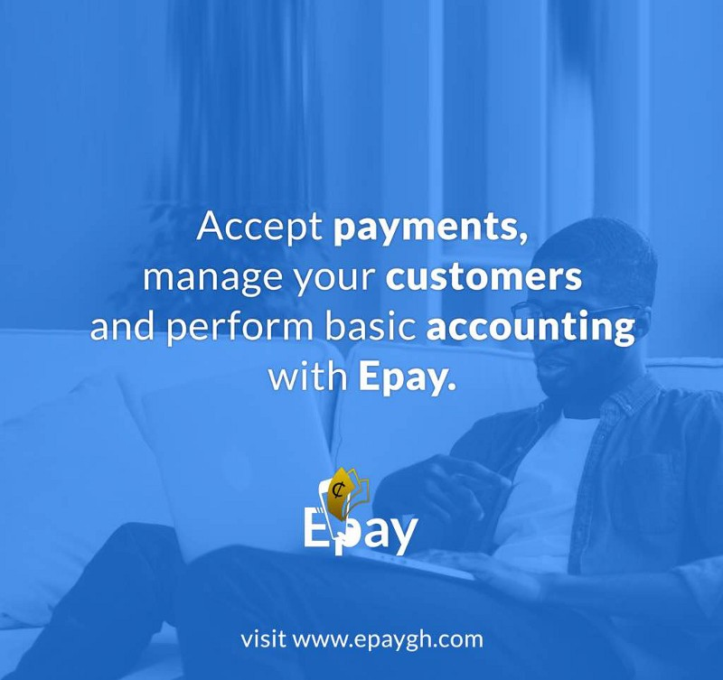

---

[**Epay**](https://epaygh.com/)  is a payment service that makes it easier for African businesses to securely accept online payments (both local and International) without coding or having a website and at no cost.

With Epay, a business through a payment page can accept payments from mobile money wallets, Credit or Debit Cards with the lowest transaction fees possible. When a business receives payment, the payment is stored in a wallet provided by Epay for the business and at anytime can be transferred to the business’s preferred bank account or mobile money wallet.

We are building the next generation’s payment service that will allow African Businesses accept online payments easily, allowing them to fully focus on building their business.

If you are a developer, [Epay](https://epaygh.com/) has been designed to allow you extend and easily integrate into systems to accept payments, without worrying about the complexity and risk that comes with processing online payments.

To developers, Epay serves as a webhook-driven checkout-as-a-service. Our well designed and beautiful checkout pages allows you to accept payments for your one-time purchase products and services, and notifies you via webhook whenever a new payment comes through. You don’t need to write a single line of payment code, you only need to worry about how to respond when a payment is successful or not.

A business can accept payment through Epay by **signing up** on [https://www.epaygh.com](https://epaygh.com/), **create a payment page** _(A “_**_Payment Page_**_” can represent anything you want to charge money for, including; a downloadable product, a private course, T-shirt etc)_ and **share the link of the payment page** with customer(s). See our [**FAQ**](https://epaygh.com/#faq)  ([https://epaygh.com/#faq](https://epaygh.com/#faq)) page for more information

---

### How different is Epay from other services out there?

_We we have built the infrastructure around the complexity and taken upon ourselves the risk in connecting multiple payment getway’s to securely process payments._

What makes us different? Aside charging the lowest transaction fees, Instant and Free settlements, you don’t need to have a website or have to be a developer to be able to accept payments on Epay. It takes 3 simple steps to start accepting payments and plus a business’s customers need not to install a mobile application or signup to our service.

We’re focused on making it super easy and flexible for Africa Businesses to accept payments starting from Ghana.

### Who can use Epay?

Anybody looking to sell products or service globally, that is, a freelancer can use the service to accept payments from customers around the world,an online service can take their subscription fees through epay, an event manager can simply create a payment page to sell tickets and even use Epay for  event registration. There are a lot of use cases as Epay makes it super easy to receive payments from customers around the world. Your customers can pay via Visa, Master Card, MTN mobile money (Ghana), Vodafone Cash (Ghana), AirtelTigo mobile money(Ghana) and many more.

### How do I signup?

Epay is currently only available via the web. Head to [www.epaygh.com](http://www.epaygh.com) to signup.

### What happens next?

Epay is still in the early stages and your feedback and suggestions are highly welcome. Over the next few weeks, we will be working closely with other developers to enhance our developer platform. Also, we would be improving the user experience to make it more easy for customers of businesses with no online payment experience make their first time payment and lastly, improve and fix bugs when the need arises.

We would love to hear your feedback on how we can improve our service. You can talk us via info@epaygh.com or hit me up personally.
