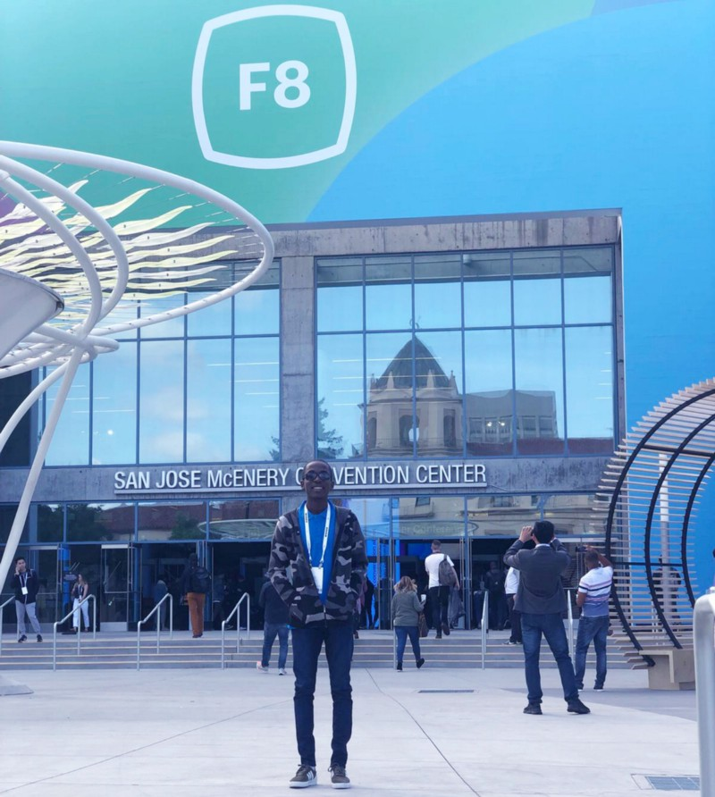
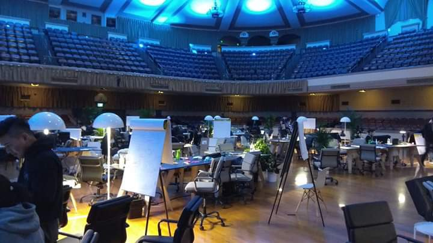
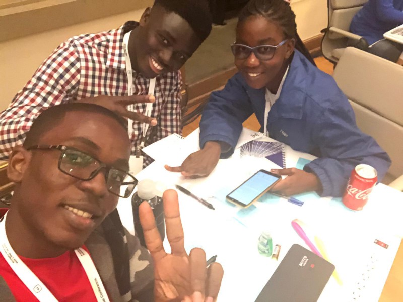
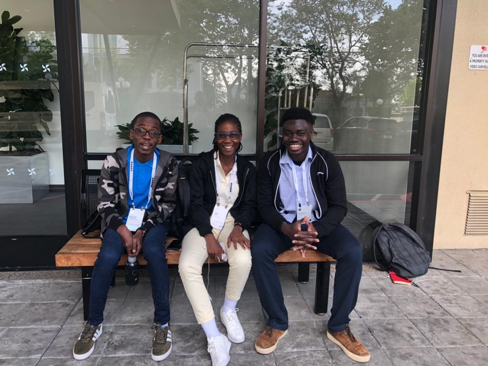
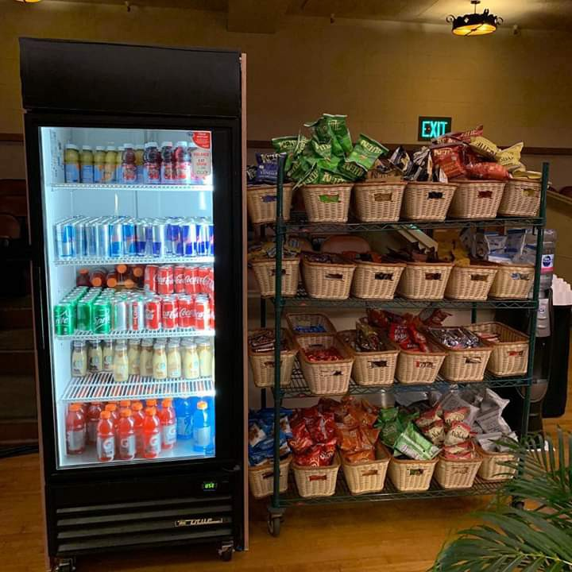
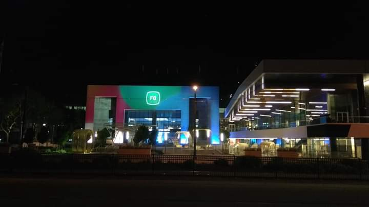
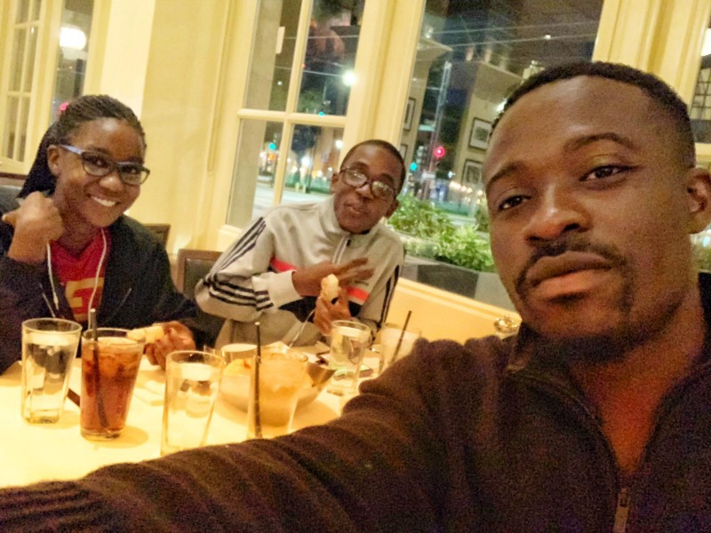
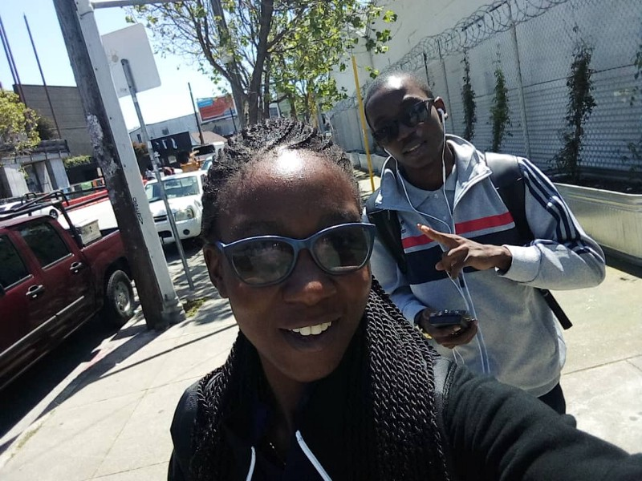
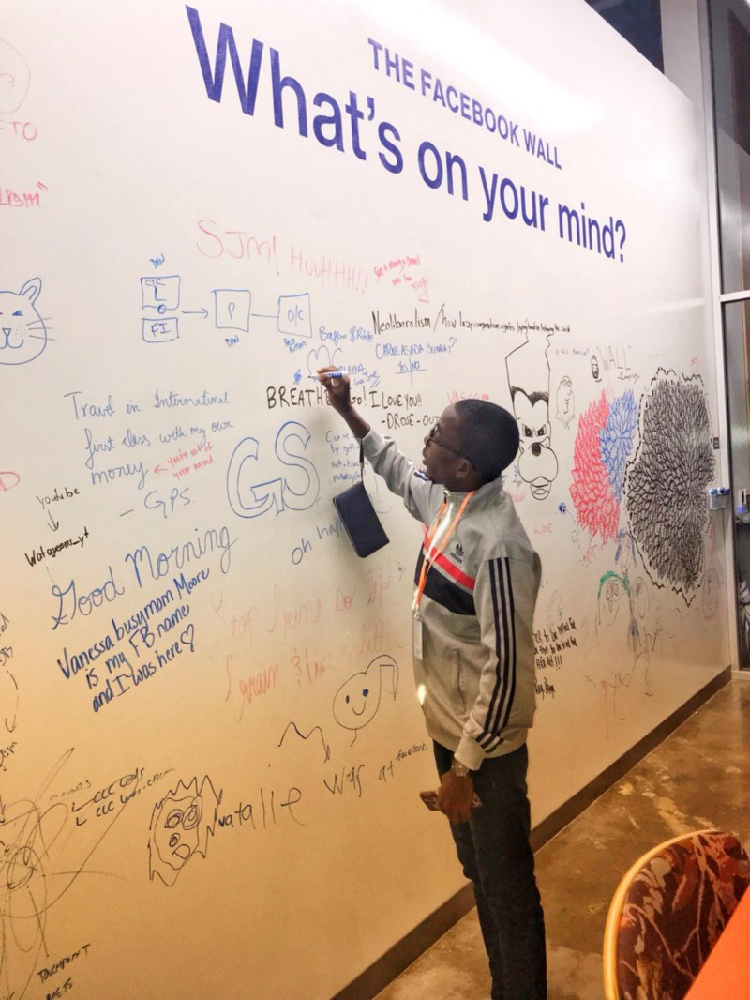

About three (3) and a half years ago I struggled to build websites with HTML & CSS. Fast forward to today, I have been to Silicon Valley ☺, participated in the F8 Hackathon and the Developer Conference all because of Facebook 🤗. For the past 3 years, I’ve been immersed in working very hard to becoming not only a world-class Software Engineer but also an Entrepreneur.

In this article, I will share with you my experiences participating in the F8 hackathon and Conference which took place from 28th April to 1st May 2019 in San Jose, California.

### Receiving My Invitation

On 20th February, [Oliver Mensah](https://twitter.com/OliverMensahDev) shared news about the hackathon and conference in the [Facebook Developer Circles Accra Group](https://www.facebook.com/groups/DevCAccra). I applied to it with no hope of getting selected but hey, what had I got to lose 🤷‍♂️.

On 21st March, I received an Email with the subject “You’re Invited to F8 2019”. The invitation included an all-expense paid trip to San Jose, California. Yes, my flight ticket and accommodation was taken care of 😎. This still gives me chills. Thank you once again, Facebook.

### Obtaining a Visa

I was super excited but it all vanished quickly after I came back to my senses realizing that there was another hurdle, which was, I needed a VISA 😫. I heard a alot of VISA denial stories and this changed my mode entirely. Obviously, I did get a VISA by God’s grace. Not to turn this article all about getting a non-immigrant U.S VISA, I will leave a few tips here for future reference.

1.  Start filling your DS-160 Online form as soon as possible
2.  You can Pay your Visa Application Fee after filling the DS-160 but can’t submit till you’ve paid for it
3.  Read through your DS-160 application very well before you submit
4.  Request for your VISA invitation letter from Sponsor
5.  Schedule your VISA interview as soon as possible
6.  I must say, you can never be prepared enough for your interview, just be yourself and be ready to back whatever you say with proof (a document)

_NB: There’s no formula for getting a non-immigrant VISA to the United States. I strongly believe it’s God which grants these VISA’s._

### The Hackathon Experience

Have you ever walked into a space and felt the energy of the room? The feeling I felt when I stepped foot into the City National Civic Center, is almost indescribable 🤯.

The hackathon hosted developers and subject matter experts from nearly 50 countries. We gathered for two days to build with Facebook’s developer products and help create social technologies that enable the best of what people can do together.

Day one began with introductions from event organizers and Facebook’s developer products by Facebook Engineers followed by a team building exercise lead by the CEO of [Devpost](https://devpost.com). After the team-building exercise, my team (the only Ghanaian Team 🇬🇭), we went straight into brainstorming. Shout out to all subject matters that helped us refine our ideas. These subject matter experts were amazing, supportive and very friendly.

_If you would like to know more about what my team (_[_Roberta Akoto_](https://www.linkedin.com/in/robbieakoto/)_,_ [_Emmanuel Acheampong_](https://www.linkedin.com/in/emmanuel-acheampong/)_,_ [_Myself_](https://devpost.com/software/borla)_) built during the hackathon, you can find it all_ [_here_](https://devpost.com/software/borla)_. All team prototypes and descriptions can also be found on the_ [_F8 2019 Hackathon website_](https://f82019.devpost.com/submissions)_._

At the end of the day, we all took a power nap of about 4 hours and went straight into coding mode in Day two. I was in charge of building a Facebook Messenger bot that gathered data around improper disposal of solid waste whilst Roberta and Emmanuel built a website that visualized data generated from the bot. It was super fun having to work with them. By the way, Emmanuel, who lives in the U.S was my senior and the first School Prefect back in Junior High School, the world is indeed a small place.

Fun Fact: In about 6 hours to the project submission deadline, we all broke down 😅. Mind you, it took us about 32 hours of flying to get there and ever since we touched down, we were only resting for 4 hours each night.

I must add that, this was the biggest and well-planned hackathon I have ever participated in. We were well-taken care of, in terms of food, Uber vouchers and a lot more. A big thanks to all the organizers 🤗

### The Conference Experience

With more than 5,000 developers, creators and entrepreneurs from around the world, Mark Zuckerberg opened the two-day event with a keynote on a privacy-focused platform. We had other leaders from Facebook, Instagram, WhatsApp, Messenger, and AR/VR speak on the latest features and announcements around the various platforms. Pssst, all attendees got a free [Oculus Quest](https://www.oculus.com/quest/?locale=en_US) 😎.

For all the hackathon participants, the day ended with Mark Zuckerberg passing by during the judging session to listen to the solutions built. Later in the day, 8 out of 42 teams qualified to the final stages of the competition. These 8 finalists pitched their solutions to us all, where we also got to vote for our favorite solution. You can also watch the finalists pitch their solutions [here](https://developers.facebook.com/videos/2019/f8-2019-hackathon-finalist-pitches/).

The second day of the F8 Conference was focused on the long-term investments Facebook is making in making in AI and AR/VR. Hackathon Winners were announced that day. The day was packed with a whole lot of activities including a party to close the event.

Later in the day, Roberta and I took a trip to San Francisco, Mountain View, Menlo Park, and Santa Clara. [Joe Darko](https://www.linkedin.com/in/joe-darko/), who really made us feel at home during the entire trip, took us to his Office on Facebook after we had dinner. Thank you very much, Joe, for your time and the effort you and your team put in to organize this hackathon.

### Key Takeaways

Below are a few lessons I have learned and has shaped me to become who I am today;

1.  I can’t emphasize enough the importance of being part of a community
2.  Don’t limit yourself to our local market only, learn skills that make you internationally attractive
3.  Build to show the skills you have rather than talking about your skills (Talk less, do more)
4.  If you are a female developer, be confident and believe in yourself. Put yourself out there
5.  If you are a student, don’t learn only from the classroom. The best way to learn software engineering is to build. Engage in internships
6.  If you have a business idea, start it. Don’t wait for the “right time” and stop waiting for “support”.
7.  Challenge yourself, think outside the box always. Don’t let society box you in.
8.  You’ve not failed until you stop trying

And Oh! Tips for first time travelers. No need for data roaming, there is quite a lot of free WiFi available. Every coffee shop or mall is likely to have one. “Don’t convert everything to Ghana Cedi else you wouldn’t buy anything”, my mum’s words before I left, yet, I still did it 😅. Things sounded more expensive when you convert the prices of goods and services to your local currency. Always carry your passport when leaving your hotel, you might not know when it will come in handy 😉. Roberta can assert to that 😅. Check the weather and prepare appropriately. Don’t say i didn’t warn you 😁.

### Appreciation

There are people who have really played an important role in where I am today, directly and indirectly. I would like to use this opportunity to say a big thank you to all of them. Not to mention all but a few, here are some of the amazing people that have being very instrumental and supportive in my journey; My Family, everyone mentioned in this article, [John Otu](https://www.linkedin.com/in/johnotu/), [Jesse Ghansah](https://www.linkedin.com/in/jesseaholmes/), [Edem Kumodzi](https://www.linkedin.com/in/edemkumodzi/), [Andrew Smith](https://twitter.com/silentworks), [Kojo Dougan](https://www.linkedin.com/in/kojo-dougan-a0390134/), [Rudolf Akrong](https://www.linkedin.com/in/rudolf-akrong-6b0b9b36/), [Michael Ocansey](https://www.linkedin.com/in/mkocansey/), [Francis Obirikorang](https://www.linkedin.com/in/swapchief/), [Francis Addai](https://www.linkedin.com/in/faddai/), [Michael Tettey Soli](https://www.linkedin.com/in/michael-agbo-tettey-soli-725a673a/), [Tom-Chris Emewulu](https://twitter.com/Iamtomchris), [Anthony Takyi](https://www.linkedin.com/in/anthony-takyi-36833384/), [Peter Perez](https://www.linkedin.com/in/peter-peregbakumo-526a34152/), [Micheal Sarpong](https://www.linkedin.com/in/michael-sarpong/), [Saliha Hotamisli](https://www.linkedin.com/in/michael-sarpong/), [Abigail Edwin](https://www.linkedin.com/in/abigail-edwin/), [Tano Onovughe](https://www.linkedin.com/in/tano-onovughe-76209a85/), [Robert Yin](https://twitter.com/robertyin7), the entire [Workshed team](https://twitter.com/Workshedafrica), Facebook Developer Circles Accra, [Sapcelab](https://twitter.com/SpaceLabKuc), [Forloop](https://twitter.com/forloopAfrica), [DevCongress](https://twitter.com/DevCongress) and many more.
