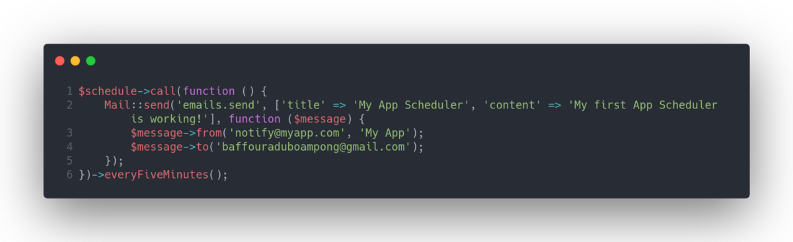

In the past, generating a Cron entry required each task to be scheduled on your server. Laravel’s task scheduling feature gives you the full power of CRON in a fluent API without having to SSH into your server to add additional Cron entries. It allows you to fluently and expressively define your task schedule within Laravel itself.

Personally, I never really understood CRON and felt it might be too difficult to set up without CPanel or on a VPS Server. In this article, I have clearly defined (to the best of my knowledge) what CRON is and how you can take advantage of it in your Laravel application.

---

### What is CRON?

CRON is a scheduling daemon that executes tasks at specified intervals. These tasks are called CRON Jobs and are mostly used to automate system maintenance or administration. You can schedule CRON Jobs to run by the minute, hour, day of the month, month, day of the week or any combination of these.

For example, you could set a CRON job to backup your databases or data, update your system with the latest security patches, check your disk space usage, send emails and more. A more practical example will be a large SaaS application that selects 10 random customers every hour during the weekend and offers them a discount. Creating a job or a script for sending the discount can be pretty easy but we need a way to run it every hour and only on weekends. That’s where CRON comes in handy.

You communicate with this scheduling daemon using **_crontab files_**. Crontab (CRON table) is a text file that specifies the schedule of CRON Jobs. Although you can edit the user crontab files manually, it is recommended to use the “**_crontab_**” command. If you are a geek like me and want to know more about CRON Jobs such as the cronjob syntax and many more, read more [_here_](https://linuxize.com/post/scheduling-cron-jobs-with-crontab/). You can use a tool like [_crontab.guru_](https://crontab.guru/) _f_or advanced use-cases and a better understanding of how your scheduled tasks are going to run.

---

### **Setup CRON Jobs on your Server**

When using the inbuilt Laravel task scheduler, you only need to add the following Cron entry to your server;

**_\* \* \* \* \* php /path-to-your-project schedule:run >> /dev/null 2>&1_**

To add the CRON entry, run “**_crontab -e_**” in your terminal to edit your crontab file. Add the above CRON entry to the end of the file. The above CRON entry will inform the CRON daemon to run the “**_php artisan schedule:run_**” artisan command every minute, pretty easy right? You only have to register one CRON job in your crontab and Laravel takes care of the rest under the hood.

---

### Defining a Scheduled Task

To define your scheduled commands, add them inside the schedule method of _Console kernel_ located at _App\\Console\\Kernel.php_. To try it out, add the code below to your schedule method;

**NB:** The above code assumes you have added the **_Mail Facade_**_(use Illuminate\\Support\\Facades\\Mail), have an_ **_email view template_** _in your emails folder inside your views called send.blade.php_ and have **mail services already configured** in your application.

Voila! You should receive an email from your application every 5 minutes. To know more about the scheduling methods Laravel provides, head to the [_official documentation_](https://laravel.com/docs/5.8/scheduling)
